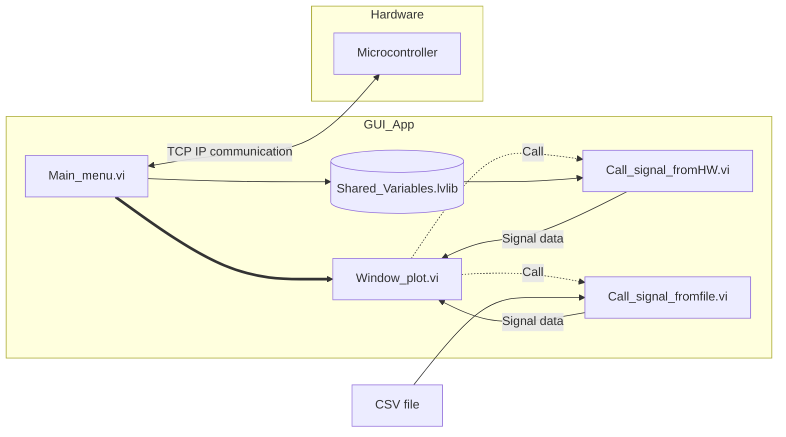

# GUI App - LabVIEW

## About The Project
### Overview
The GUI application is the main interface for the user to interact with the control system. It is responsible for displaying the data, sending commands to the microcontroller, and handling errors. The GUI application is built using LabVIEW, a graphical programming language that allows for easy and intuitive development of user interfaces.

### Built with and for
- [Labview](https://www.ni.com/en/shop/labview.html)

### Project Structure
VI Hierarchy of the project:

## Getting Started

### Prerequisites
- NI LabVIEW Runtime 2022 Q3 Patch 1 (64-bit). [Labview Runtime](https://www.ni.com/en/support/downloads/software-products/download.labview-runtime.html#460613)
- Access to the GUI App in the [labview folder] (labview/builds/GUI App/GUI_App.exe)

### Requirements installation

- [Labview Runtime](https://www.ni.com/en/support/downloads/software-products/download.labview-runtime.html#460613) 
  - **Current Version in LabVIEW Development:** LabVIEW 2022 Q3 Patch 1 (64-bit)
- Download GUI App in the [GUI_App folder](labview/builds/GUI_App/GUI_App.exe)

### Usage
- Run the executable file GUI_App

## Documentation
The current labview project is developed in LabVIEW 2022 Q3 Patch 1 (64-bit). 
The project is divided into the following sections:

The documentation changes are located in the [documentation_log](documentation_log) folder.

## License
<!-- This project is licensed under the MIT License - see the [LICENSE.md] -->

## Contact 
Victor H - @VictorUhr

