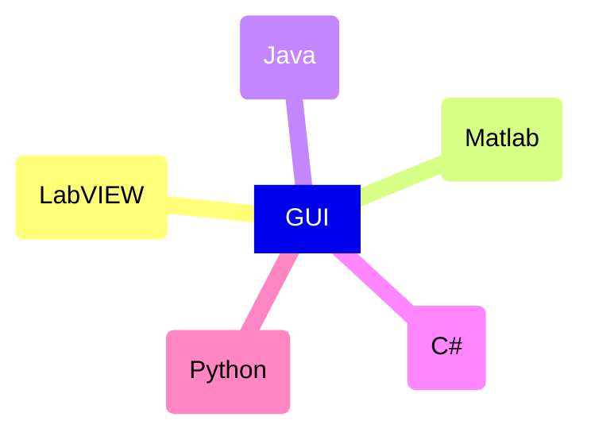

<--! Markdown -->
# GUI comparison technologies

## Introduction

This document serves as a comparative analysis of various Graphical User Interface (GUI) technologies that are potential candidates for the development of the GUI for the LRS project. The comparison is structured around the following key aspects:
- Characteristics
- Benefits
- Limitations
- GUI construction tools

The technologies under consideration include:
- LabVIEW
- Matlab
- Python
- C#
- Java

This document also details the substantial modifications made to our project's naming conventions. The main goal of these modifications is to improve the readability, maintainability, and uniformity of our codebase.

Our project, which heavily relied on LabVIEW for the development of the Graphical User Interface (GUI) Application, is a graphical programming language extensively used for test, measurement, and control applications.

The modifications affect various elements of our project, such as VI, Functions, TCP Client, and Variables. Each section in this document corresponds to these elements and offers a comprehensive overview of the old names, the new names, and a brief explanation of their functions.
By standardizing our naming conventions, we strive to create an environment that is more intuitive and user-friendly for our team and potential future contributors. This not only simplifies the process of understanding the code but also facilitates debugging, testing, and future enhancements of the project.

## LabVIEW
### Properties
- Graphical programming platforms
- Leader in the field of computer based measurement and data adquisition
- Suitable for adquiring, procesing and displaying signals. [0](https://annals.fih.upt.ro/pdf-full/2012/ANNALS-2012-3-68.pdf)
### Advantages
- It does not spend too much time for derivation process [1](https://ieeexplore.ieee.org/document/7125143/figures#figures)
- Fast and simple construction of the graphical user interface [0](https://annals.fih.upt.ro/pdf-full/2012/ANNALS-2012-3-68.pdf)
- Most MATLAB functions are accessible from LabVIEW via the MathScript Node. [0]
### Disadvantages
- It is not suitable for calculations. [0](https://annals.fih.upt.ro/pdf-full/2012/ANNALS-2012-3-68.pdf)

## Matlab
### Properties
- Graphical programming platforms
- Allows modeling, simulation and analysis of dynamic systems. [0](https://annals.fih.upt.ro/pdf-full/2012/ANNALS-2012-3-68.pdf)
- Suitable for computation.
### Advantages
- In simulation, MATLAB/Simulink shows better performance than Labview. [1](https://ieeexplore.ieee.org/document/7125143/figures#figures)
- Classical program code is much more appropriate for calculations. [0](https://annals.fih.upt.ro/pdf-full/2012/ANNALS-2012-3-68.pdf)
### Disadvantages

## Python
### Properties
- Fourth most popular coding language in the world. [2](https://insights.stackoverflow.com/survey/2020#most-popular-technologies)
- It used mainly for IoT, data science, and machine learning applications. [3](https://www.coursera.org/articles/python-vs-java)
- Python has had a 25 percent growth rate, adding 2.3 million developers to its community between Q3 2020 and Q3 2021. [4](https://slashdata-website-cms.s3.amazonaws.com/sample_reports/_TPqMJKJpsfPe7ph.pdf)
### Advantages
- It’s platform-independent 
  - Like Java, you can use Python on various platforms, including macOS, Windows, and Linux. You’ll just need an interpreter designed for that platform.
- It allows for fast development 
  - Because Python is dynamically typed, it's fast and friendly for development. Additionally, it uses asynchronous code to tackle situations and challenges faster because each unit of code runs separately.
- It offers extensive libraries
  - Its large library supports common tasks and commands. It also contains code that can be used for many different purposes, ranging from generating documentation to unit testing to CGI.
- It offers a more flexible approach to programming 
  - Python supports a variety of programming styles and has multiple paradigms. Not only is this optimal for programmers who enjoy flexibility, but it also makes it ideal for start-ups that might need to shift approaches abruptly.
- It's free and open-source
  - You can download Python without any cost, and because it's so easy to learn and boasts one of the largest and most active communities—you should be able to start writing code in mere minutes.
- It may boost productivity
  - NetGuru says that Python is more productive than Java because of how concise it is and because it's dynamically typed [6]. Additionally, it has control capabilities and integration features that can make applications more productive.

### Disadvantages

- It only executes one thread at a time 
  - Python has a Global Interpreter Lock that only lets one thread execute at a time, so if you're working on a multi-threaded CPU-bound program, it'll likely be even slower. Using multiprocessing programs instead of multithreaded programs can be an effective workaround.
- It isn't mobile native
  - Python can be effectively and easily used for mobile purposes, but you'll need to put a bit more effort into finding libraries that give you the necessary framework. Some examples include Kivy, which lets you use the same API to create mobile apps and software that you can run on Raspberry PI, Linux, and Windows.
- It uses a large amount of memory
  - If you're working on a project where many objects are active in RAM, this could present an issue for you. Switching to NumPy could be an effective workaround to reduce the amount of memory Python uses for each object.

### GUI builder

#### PyQt
- Code text https://doc.qt.io/qtforpython/contents.html
- Framework software no free https://www.qt.io/pricing
#### Tkinter
- Code text https://wiki.python.org/moin/TkInter
- Embedded in Python
#### PySimpleGUI
- Code text https://www.pysimplegui.org/en/latest/
- Takes from Qt, Tkinter, WxPython, and Remi. Detail https://www.activestate.com/blog/top-10-python-gui-frameworks-compared/

## C#

### Properties

- Fully object-oriented programming languages
- Statically-typed compiled language

### Advantages
- Better performance and high than python
- It includes a build/compile step
- Excellent for Microsoft integration, top performance, and reliance on a standard syntax and libraries

### Disadvantages
- Get premium to ensure that developers get help and emergency support from Microsoft
- Writing and deploying code

## Java

### Properties
- 5th most commonly used programming language. https://insights.stackoverflow.com/survey/2020#most-popular-technologies
- Object-oriented language
- Compiled language
  - Unlike Python, Java is a compiled language, which is one of the reasons that it’s your faster option. When you program with compiled languages like Java, the coding gets directly converted to machine code. That lets the processor execute much more quickly and efficiently while giving you increased control over hardware aspects like CPU usage. Other examples of compiled languages include C and C++, Rust, Go, and Haskell. https://www.coursera.org/articles/python-vs-java
- Widely used in web development, big data, and Android app development. Also to cloud development and the Internet of Things (IoT)

### Advantages

- Simple that C++
    - It's simple: The syntax is straightforward, making it easy to write. It's not as complex as languages like C++, and it uses automatic memory allocatio
- platform independent
  - It’s platform independent: You can use Java on multiple types of computers, including Windows, iOS, Unix, and Linux systems, as long as it has the Java Virtual Machine (JVM) platform.
- Object-oriented
  - It’s object-oriented: Because you create classes containing data and functions and objects that belong to those classes, it offers a more intuitive approach for big project development. It also provides flexibility and easier troubleshooting, and the ability to reuse the code.
- Large global community
  - It has a large global community: This is helpful when you're learning Java or should you run into any problems.
- Supports multithreading
  - It supports multithreading: When you use Java, you can run more than one thread at a time. When running multiple threads, they share a common memory area to increase efficiency and performance.
- Secure
  - It’s secure: Java avoids using explicit pointers, runs inside a virtual machine called a sandbox, uses byte-code verifier to check for illegal code, and provides library-level safety along with Java security package and run-time security checks.

### Disadvantages

- It doesn’t offer control over garbage collection. 
  - As a programmer, you won’t have the ability to control garbage collection using functions like free() or delete().
- It has a lot of words
  - Although Java is simple, it does tend to have a lot of words in it, which will often leave you with complex, lengthy sentences and explanations.
- It doesn't have a native look when you use it for desktops:
  - Java has multiple graphical user interface (GUI) builders, but they aren't the best if you're creating complex UI on a desktop. Java is weaker when you're using it for desktop versus mobile when it comes to user experience and user interface. While there are many GUI builders to choose from, you'll need to do a lot of research to find the right one for your project.

### GUI builder
-   IntelliJ IDEA
  -   Version basic and Version for pay. https://www.jetbrains.com/idea/download/#section=mac
- JavaFx
  - Open source https://openjfx.io/

## Mindmap

